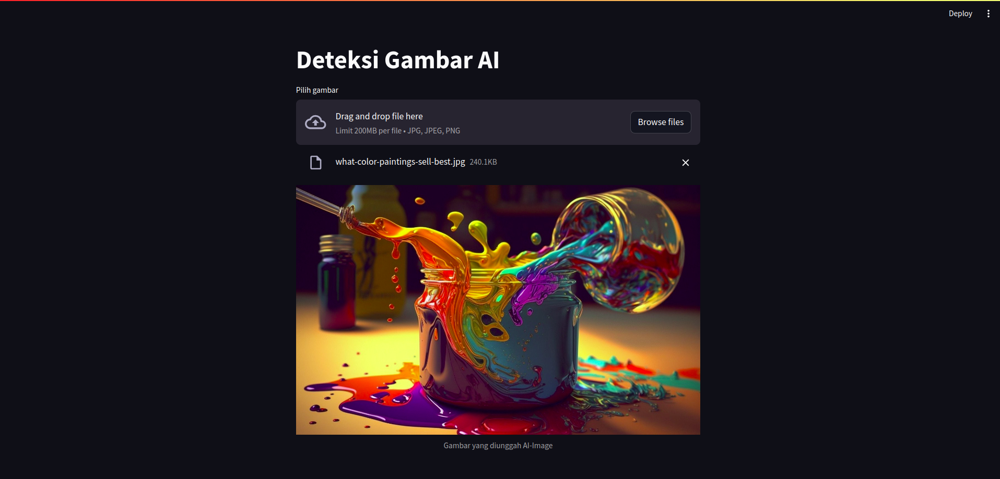

# AI and Real Image Classification using ResNet18

## Description
I built this project to develop an image classification system that can distinguish between images generated by artificial intelligence (AI) and real images. I used a pre-trained ResNet model and performed some fine-tuning on the dataset.

## Requirements
- Python 3.x
- PyTorch
- NumPy
- Matplotlib

## Dataset
```url
https://www.kaggle.com/datasets/cashbowman/ai-generated-images-vs-real-images
```
The dataset I used consists of two classes: AI-generated and real. This dataset is available in separate folder formats for each class. To maintain class balance, I collected a similar number of datasets for both classes.

## Pre-trained Model
I used a pre-trained ResNet model on the ImageNet dataset. This model is available in the PyTorch library.

## Fine-tuning
I fine-tuned the ResNet model by replacing the last fully connected (fc) layer with a layer that has an output of 2, according to the number of classes I have (AI-generated and real). Then, I retrained the model using the prepared dataset. I used transfer learning techniques to speed up the training process and improve model performance.

## Results
After training the model, I achieved an accuracy of around 81% on the test dataset. Before using the ResNet model, by building the model architecture manually, I obtained an accuracy of around 67%.

## References
- ResNet: https://arxiv.org/abs/1512.03385
- PyTorch: https://pytorch.org/
- Kaggle: https://www.kaggle.com/

## Training Process
- Training : https://www.kaggle.com/code/sandarmanatapaima/aiart-realart-classification-resnet 
